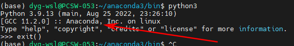
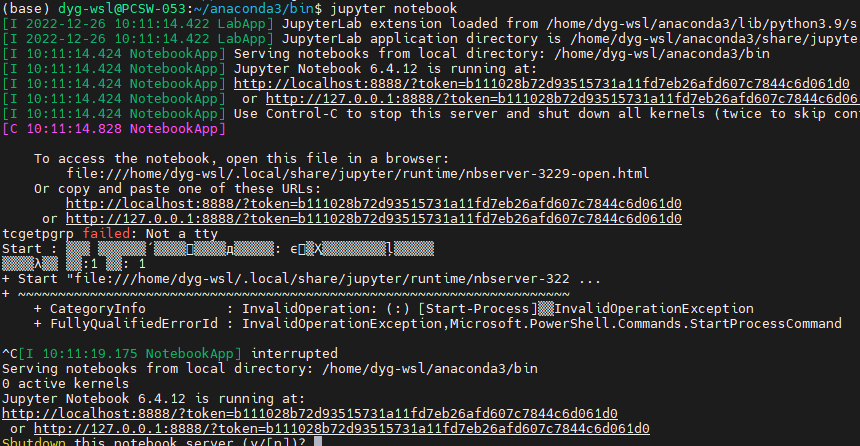
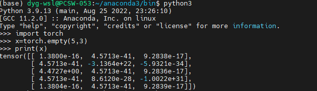

# 人工智能学习记录

## 学习环境准备

已存在环境：
  
    * WSL2 Ubuntu 20.04
    * Python 3.8.10

### 安装 Anaconda

Anaconda 是一个开源的 Python 发行版，用于科学计算，包含了 conda、Python 等 1,500 多个科学包及其依赖项。Anaconda 可以在 Linux、macOS 和 Windows 上运行。

linux安装官网：https://docs.continuum.io/anaconda/install/linux/

```bash
# 下载安装包
wget https://repo.anaconda.com/archive/Anaconda3-2021.05-Linux-x86_64.sh

# 安装
bash Anaconda3-2021.05-Linux-x86_64.sh
```

安装完成后，最后一个步骤会问你要不要将 Anaconda 的路径添加到 PATH 中，推荐选择 yes。

如果选择了no，那么需要手动添加环境变量：

```bash
# 打开配置文件
vim ~/.bashrc

# 添加环境变量
export PATH="/home/username/anaconda3/bin:$PATH"
```

或者通过命令行添加：

```bash
# 进入到anaconda安装目录
cd /home/username/anaconda3/bin

# 添加环境变量
source activate

# init
conda init
```

此时我们查看python3的不同，多了个`：：Anaconda`：



检查是否安装成功：

```bash
# 查看版本
conda -V

# 启动jupyter
jupyter notebook
```



浏览器打开`http://localhost:8888`，即可看到jupyter的界面。

### 安装 PyTorch

PyTorch 是一个基于 Python 的科学计算包，主要用于两个领域：一是作为 NumPy 的替代品，可以使用GPU加速计算；二是作为深度学习平台，提供了最大的灵活性和速度。

安装官网：https://pytorch.org/get-started/locally/

按照官网和本地环境，先择对应的不同的安装命令，本示例选择的是`stable(1.3.1)`、`Linux`、`Conda`、`Python`、 `CPU`:

```bash
# 安装
conda install pytorch torchvision torchaudio cpuonly -c pytorch
```

安装完成后，检查是否安装成功：

```bash
# 查看版本
python -c "import torch; print(torch.__version__)"
```
或者通过验证是否能导入torch来验证：

```bash
# 进入python3
python3

# 导入torch并进行一个运算
import torch
x = torch.empty(5, 3)
print(x)
```

输出：


## 知识了解

### 什么是tensorflow

TensorFlow 是一个开源的机器学习库，由 Google 开发，用于机器学习和深度学习等领域。TensorFlow 提供了 Python 和 C++ 两种编程语言的 API，支持 Linux、macOS 和 Windows 等多种操作系统。

tensorflow中文官网：https://tensorflow.google.cn/。

由于tensorflow相关基础知识较多，这里只是简单介绍一下，贴上以下知乎文章有利于大家的理解：

[什么是tensorflow](https://zhuanlan.zhihu.com/p/59077525)


### NumPy

NumPy 是一个 Python 的开源扩展程序库，支持高性能的多维数组对象，以及用于处理数组的各种函数。NumPy 的主要对象是同构多维数组。它是一个元素表（通常是数字），所有类型都相同，由非负整数元组索引。在 NumPy 维度中称为轴。数组的数字称为元素或元素。NumPy 的数组类被称为 ndarray。它也被称为别名数组。

NumPy 的主要目的之一是用于数组计算。它提供了线性代数和随机数生成的功能。NumPy 可以与其他库集成，例如 Matplotlib（绘图库）、OpenCV（图像处理库）等。

NumPy 官网：https://numpy.org/

### PyTorch

PyTorch 是一个基于 Python 的科学计算包，主要用于两个领域：一是作为 NumPy 的替代品，可以使用GPU加速计算；二是作为深度学习平台，提供了最大的灵活性和速度。

PyTorch 官网：https://pytorch.org/

为理解和练习 PyTorch，在此贴上一篇知乎文章：

[pytorch 60题](https://zhuanlan.zhihu.com/p/99318332#:~:text=60%E9%A2%98PyTorch%E7%AE%80%E6%98%93%E5%85%A5%E9%97%A8%E6%8C%87%E5%8D%97%EF%BC%8C%E5%81%9A%E6%8A%80%E6%9C%AF%E7%9A%84%E5%BC%84%E6%BD%AE%E5%84%BF%F0%9F%8C%8A%201%201%20%E5%88%9D%E8%AF%86PyTorch%202%201.1%20%E5%BC%A0%E9%87%8F%201.%E5%AF%BC%E5%85%A5pytorch%E5%8C%85,3%20%E7%A5%9E%E7%BB%8F%E7%BD%91%E7%BB%9C%20%E8%BF%99%E9%83%A8%E5%88%86%E4%BC%9A%E5%AE%9E%E7%8E%B0LeNet5%EF%BC%8C%E7%BB%93%E6%9E%84%E5%A6%82%E4%B8%8B%E6%89%80%E7%A4%BA%208%203.1%20%E5%AE%9A%E4%B9%89%E7%BD%91%E7%BB%9C%20...%20%E6%9B%B4%E5%A4%9A%E9%A1%B9%E7%9B%AE)

使用PyTorch搭建卷积神经网络：https://blog.csdn.net/juhanishen/article/details/123462838

PyTorch搭建CNN卷积神经网络详解：https://blog.csdn.net/weixin_44912159/article/details/105345760

