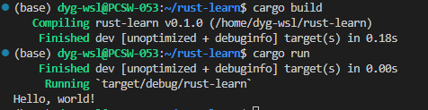
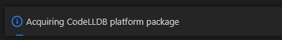
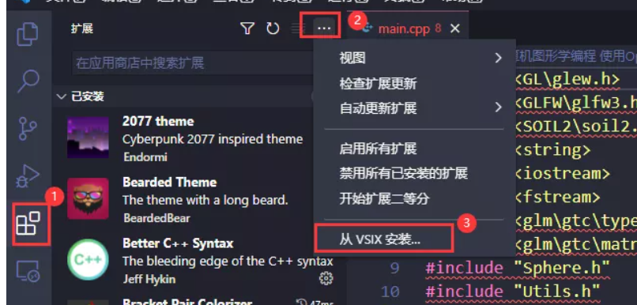
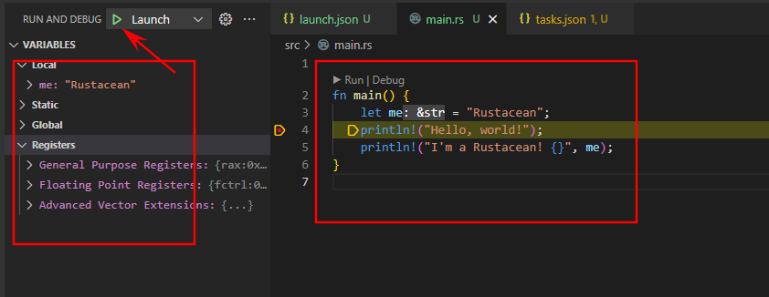

# Rust

## 环境准备

当前环境：
  WSL2 + Ubuntu 20.04

### 安装 Rust

```bash
# 安装
curl --proto '=https' --tlsv1.2 -sSf https://sh.rustup.rs | sh

# 刷新环境变量
source $HOME/.cargo/env

# 查看版本
rustc -V
cargo -V
```

结果如下所示：


### 安装C语言环境
```bash
# 更新源
sudo apt-get update  # 如果不更新源，可能会出现无法找到软件包的情况

sudo apt install build-essential
```

### 创建一个rust项目

```bash
# 创建一个项目
cargo new rust-learn

# 进入项目
cd rust-learn

# 编译项目
cargo build

# 运行项目
cargo run
```

结果如下所示：



### vscode调试

在 WSL ubuntu 20.04 环境下

1. 安装插件：CodeLLDB

直接在 vscode 中搜索 CodeLLDB 并安装。此方法可能在运行调试时还要安装平台：



所以我们可以直接安装平台包：

https://github.com/vadimcn/vscode-lldb/releases/download/v1.8.1/codelldb-x86_64-linux.vsix

选择合适的版本下载

然后在vscode中安装：



这样就不再需要安装平台了。

2. 配置launch.json

如果项目目录下没有`.vscode`目录，则新建一个，如果有，则直接在`.vscode`目录下新建`launch.json`文件。

配置内容：

```json
{
  "version": "0.2.0",
  "configurations": [
    {
      "type": "lldb",
      "request": "launch",
      "name": "Launch",
      "program": "${workspaceFolder}/target/debug/${workspaceFolderBasename}",
      "args": [],
      "cwd": "${workspaceFolder}"
    },
  ]
}
```

然后在vscode的debug功能下运行：


