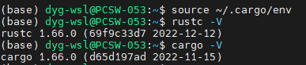

# Rust

## 环境准备

当前环境：
  WSL2 + Ubuntu 20.04

### 安装 Rust

```bash
# 安装
curl --proto '=https' --tlsv1.2 -sSf https://sh.rustup.rs | sh

# 刷新环境变量
source $HOME/.cargo/env

# 查看版本
rustc -V
cargo -V
```

结果如下所示：


